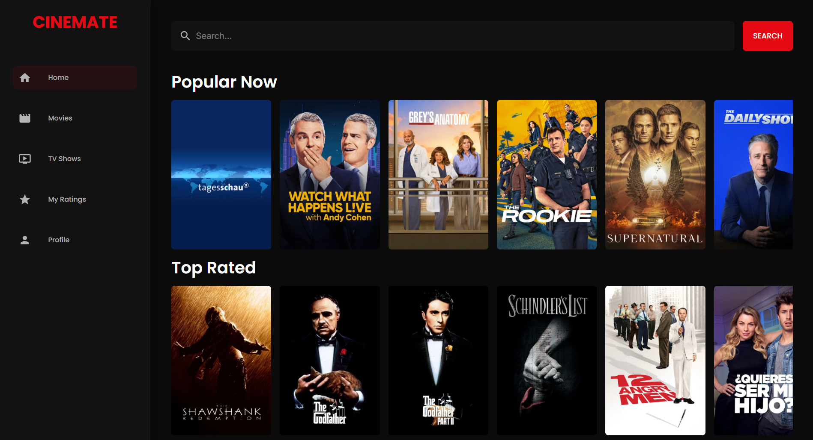
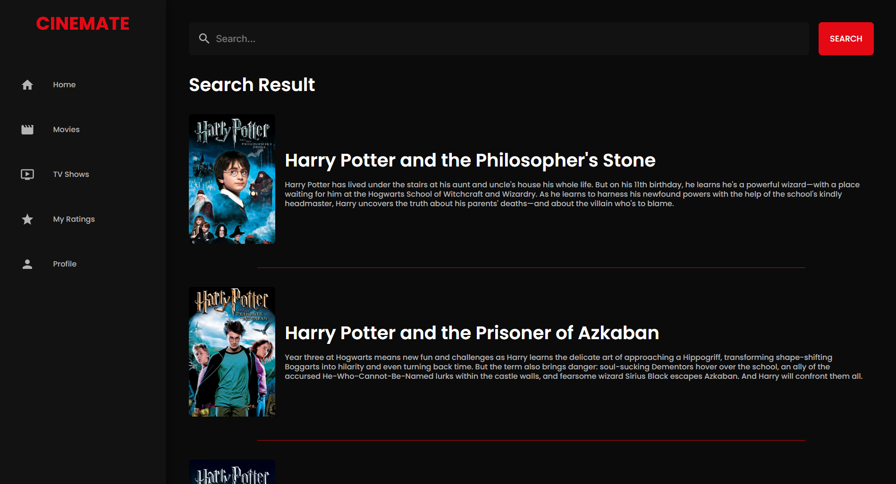
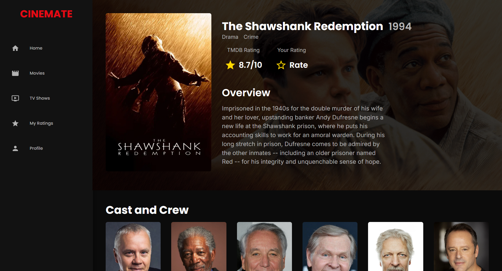
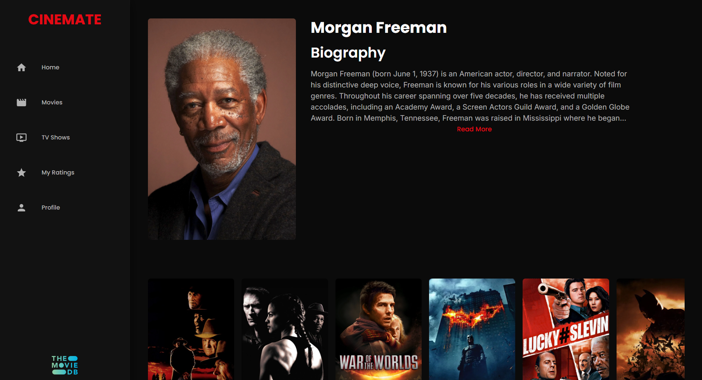
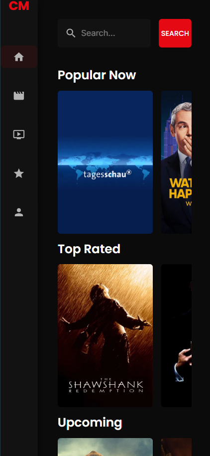

# Cinemate

Cinemate is a **responsive React web app** for discovering movies, TV shows, and actors using the TMDB API.

The application focuses on providing a smooth browsing experience through:
- Skeleton loading states
- Section-level error handling
- Persistent ratings stored in localStorage
- Clean mobile-first UI

---

## 🌐 Live Demo
🔗 [Cinemate on Vercel](https://cinemate-eta-blond.vercel.app/)

---

## ✨ Features

### 🎥 Movie & TV Discovery
- Browse Popular, Top Rated, Upcoming, and Now Playing movies
- Explore TV shows with multiple discovery sections

### 🔎 Search
- Search across movies, TV shows, and actors
- Clickable search results that navigate to details page

### 📄 Detailed Pages
- Movie and TV show overview pages
- Actor profile pages with filmography

### ⭐ Ratings
- Users can rate titles
- Ratings are persisted using localStorage

### ⚡ UX Improvments
- Skeleton loaders for smooth loading states
- Section-specific error handling
- Responsive layout for desktop and mobile

## ⚒️ Tech Stack

**Frontend**
- React
- Redux Toolkit
- React Router
- Material-UI

**API**
- TMDB API

**Deployment**
- Vercel

**Language**
- JavaScript (ES6+)

## 🚀 Installation

- Clone the repo: `git clone https://github.com/abdullah-zeinalabdin/cinemate.git`
- Navigate into the project folder: `cd cinemate`
- Install dependencies: `npm install`
- Create a `.env` file in the root folder and add your TMDB API token: `REACT_APP_TMDB_TOKEN=your_tmdb_api_token`
- Start app locally: `npm start`
- Open [http://localhost:3000](http://localhost:3000) in your browser to see the app

## 📸 Screenshots

### 🏠 Home Page

### 🔎 Search Results

### 🎬 Movie Details

### 🎭 Cast Details

### 📱 Mobile View

## 🔮 Future Improvments
- Genre filtering
- User authentication
- Performance optimizations

## 📄 License & Attribution

- This project is licensed under **MIT**.
- This product uses the **TMDB API** but is **not endorsed or certified by TMDB**